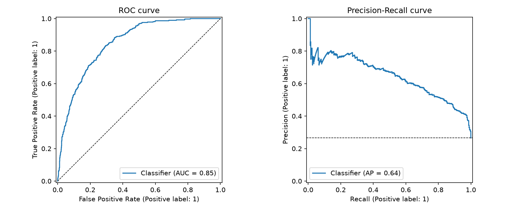
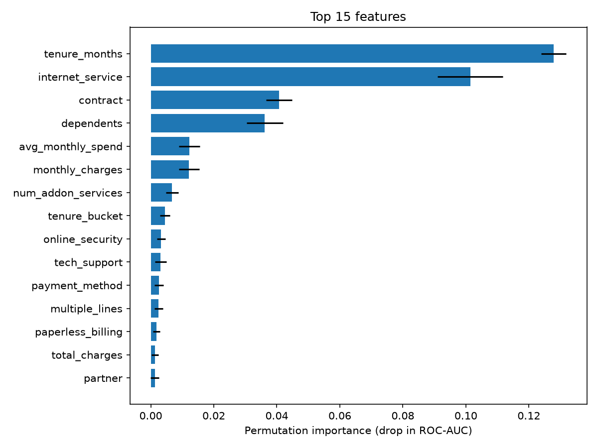

# Customer Churn Prediction

An end-to-end, production-style machine learning project that predicts which
telecom customers are likely to churn, so a retention team can intervene
*before* they leave.

**Model:** tuned logistic regression · **test ROC-AUC 0.849** · catches
**91.7% of churners** at the business-tuned decision threshold.

---

## Business problem

Acquiring a telecom customer costs 5–7× more than retaining one. The model
scores every customer monthly and hands the retention team a ranked list of
at-risk customers, using only information available **before** a customer
decides to leave. Because a missed churner (lost lifetime value) costs far
more than a wasted retention offer (small discount), the decision threshold
is deliberately tuned to favour recall.

## Dataset

[IBM Telco Customer Churn](https://www.kaggle.com/datasets/yeanzc/telco-customer-churn-ibm-dataset)
(33-column Excel version) — 7,043 customers, 26.5% churn rate. Place the file
at `data/raw/Telco_customer_churn.xlsx` (data files are gitignored).

## Results

Model families compared under identical 5-fold stratified CV (pipelines
cross-validated as a unit, so encoding/scaling are re-fitted per fold):

| Model | CV ROC-AUC |
|---|---|
| **Logistic regression** (tuned C≈2.64) | **0.859** |
| Random forest | 0.846 |
| XGBoost | 0.840 |

Held-out test set (n=1,409), tuned model:

| Metric | @ default 0.50 | @ tuned 0.29 |
|---|---|---|
| Recall (churners caught) | 79.1% | **91.7%** |
| Precision | 51.8% | 43.4% |
| F2 | 0.716 | **0.750** |
| ROC-AUC | 0.849 | 0.849 |

The threshold (0.29) was chosen to maximise F2 on **out-of-fold training
predictions** — never on the test set.




## Project structure

```
├── app/                  Streamlit UI (single + batch scoring)
├── configs/config.yaml   All paths, column contracts and hyperparameters
├── data/raw|processed/   Raw Excel export and persisted train/test splits (gitignored)
├── logs/                 Pipeline logs (gitignored)
├── models/               Serialized model artifact (gitignored)
├── notebooks/            01 data understanding → 05 evaluation (thin: call src/ only)
├── reports/              Metrics, plots, feature importances, interview prep
├── src/                  All reusable logic (see below)
└── tests/                Pytest suite on a synthetic raw-schema fixture
```

`src/` modules, one responsibility each:

| Module | Responsibility |
|---|---|
| `data_loader.py` | load the raw Excel export |
| `data_validation.py` | 33-column schema contract; fails loudly on drift |
| `preprocessing.py` | stateless cleaning + stratified train/test split |
| `feature_engineering.py` | engineered features + fitted ColumnTransformer |
| `model_training.py` | candidate models, CV comparison, randomized tuning |
| `evaluation.py` | threshold tuning, test metrics, plots, permutation importance |
| `inference.py` | artifact loading, single/batch scoring with risk bands |
| `train_pipeline.py` | one-command end-to-end orchestration |
| `utils.py` | project paths, config loading, logging |

## Setup

```bash
python -m venv .venv
source .venv/bin/activate
pip install -r requirements.txt
brew install libomp        # macOS only: OpenMP runtime for XGBoost
```

## Usage

Train everything (validate → clean → engineer → compare → tune → evaluate →
serialize) in one command:

```bash
python -m src.train_pipeline
```

Launch the app:

```bash
streamlit run app/streamlit_app.py
```

Run the tests:

```bash
python -m pytest tests/ -q
```

## Key design decisions

1. **Data leakage is handled first, not last.** `Churn Score` (IBM's own model
   output), `Churn Reason` (only known after churn), `Churn Label` (target
   duplicate) and `CLTV` are dropped before any modelling. This is the
   difference between a portfolio project and a production incident.
2. **Stateless vs fitted transforms are separated.** Row-wise cleaning and
   engineered features are pure functions reused verbatim at inference;
   anything fitted (scaling, one-hot) lives inside the sklearn Pipeline so CV
   re-fits it per fold.
3. **Class imbalance via cost weighting**, not resampling — simpler,
   leakage-free, and equally effective for these model families.
4. **The threshold is a business decision.** 0.29 trades precision for recall
   because the cost matrix is asymmetric; both operating points are reported.
5. **The simplest model won.** Logistic regression beat gradient boosting on
   clean, mostly-linear tabular data — and ships with interpretability for free.

See [reports/interview_prep.md](reports/interview_prep.md) for a phase-by-phase
Q&A covering every decision above.
